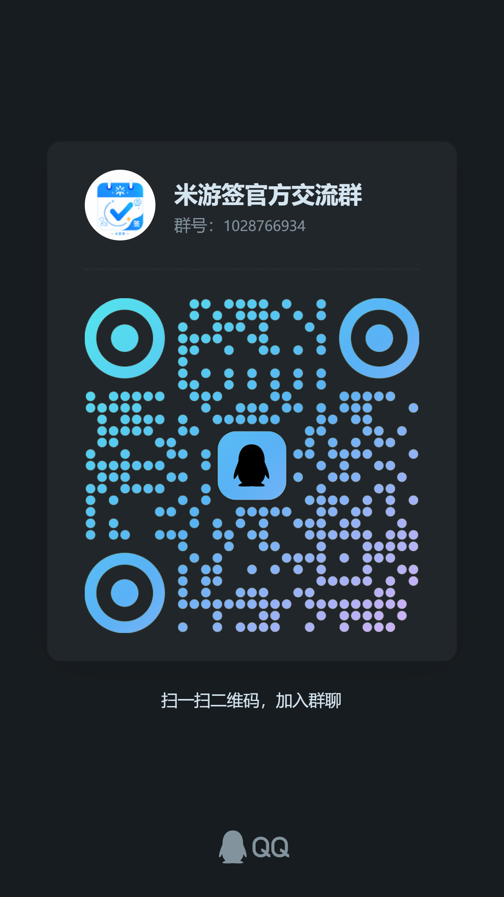

# 米游签（MiyoQian）— NoneBot2 插件

<div align="center">
  <h1 align="center">
    米游签
  </h1>
  <p>米游社签到、云游戏签到、米游币任务、商品兑换 —— 作为 NoneBot2 插件运行，QQ 指令触发，每日自动执行</p>
  <p>
    
    
    
    
  </p>
</div>

---

## 简介

米游签是一款基于 NoneBot2 的米游社自动签到插件。你只需要在 QQ 里给机器人发一条指令，就能完成扫码登录、立即签到、查看状态等所有操作；配合 `nonebot-plugin-apscheduler`，插件会在后台每天定时执行签到任务，结果通过配置的推送渠道发送。

### 请勿在其他平台宣传本项目，请不要大范围传播本项目！！！

### 交流群

如果你有兴趣参与开发，或者在使用过程中遇到问题，可以加入交流群：

<p align="center">
  
</p>

## 功能

- 米游社 APP 扫码登录（QQ 私聊扫码，无需浏览器）
- 多账号管理
- 游戏社区签到
- 云游戏签到（云原神、云绝区零）
- 米游币社区任务
- 米游社商品兑换
- QQ 指令交互（run / status / login / toggle / reload）
- 每日自动定时执行（APScheduler，随机波动）
- 执行结果推送（pushplus / Telegram / 钉钉 / 飞书 / 邮箱 / QQ）
- 自动过验证码（打码狗）

## 支持的游戏

| 游戏 | 配置名 |
| --- | --- |
| 原神 | `genshin` |
| 崩坏：星穹铁道 | `starrail` |
| 绝区零 | `zzz` |
| 崩坏3 | `honkai3rd` |
| 未定事件簿 | `tears` |
| 崩坏学园2 | `honkai2` |

默认启用原神、崩坏：星穹铁道、绝区零。其他游戏可以通过 QQ 指令或编辑 `config.yaml` 开启。

---

## 快速开始

### 1. 安装 NoneBot2

如果还没有 NoneBot2 项目，先按 [NoneBot2 官方文档](https://nonebot.dev/docs/) 初始化一个空 bot 项目。

### 2. 安装插件

```bash
pip install -e .
# 或
uv pip install -e .
```

项目会自动安装 `nonebot2`、`nonebot-adapter-onebot`、`nonebot-plugin-apscheduler` 等依赖。

### 3. 配置 .env

复制示例配置并填写：

```bash
copy .env.example .env
```

编辑 `.env`，至少需要填写：

```env
# 超级用户（你的 QQ 号，用于触发指令）
SUPERUSERS=["你的QQ号"]

# 加载插件
PLUGINS=["nonebot_plugin_miyouqian"]
```

如果你使用 OneBot V11 适配器（go-cqhttp / Lagrange / NapCat 等），还需要在 `.env` 或 `nonebot` 配置中正确设置连接方式。

### 4. 启动机器人

```bash
python bot.py
```

启动成功后，NoneBot 会自动加载插件。首次运行时，插件会从 `config.example.yaml` 复制一份到 `nonebot_plugin_miyouqian/config.yaml` 作为初始配置。

### 5. 在 QQ 中登录账号

打开 QQ，私聊你的机器人（必须私聊，群聊无法扫码登录），发送：

```
/myq login
```

机器人会回复一张二维码图片，用米游社 APP 扫码：

```
米游社 APP → 我的 → 左上角扫一扫
```

扫码成功后，机器人会回复登录结果。可以指定账号名：

```
/myq login 小号1
```

### 6. 立即测试一次签到

```
/myq run
```

机器人会回复签到结果。如果提示"今日已签到"，说明配置正确。

### 7. 开启每日自动签到

编辑 `nonebot_plugin_miyouqian/config.yaml`：

```yaml
schedule:
  enable: true
  time: "09:00"
  jitter_minutes: 45
```

重启机器人后，每天 09:00 ~ 09:45 之间会自动执行签到。

---

## QQ 指令一览

指令前缀默认 `myq`，配合 NoneBot 的 `COMMAND_START`（默认 `/`）即为 `/myq`。

| 指令 | 说明 |
| --- | --- |
| `/myq` | 显示帮助 |
| `/myq run [账号名]` | 立即执行签到（可选指定账号） |
| `/myq run --games` | 仅执行游戏社区/云游戏签到 |
| `/myq run --bbs` | 仅执行米游币社区任务 |
| `/myq run --game genshin` | 仅执行指定游戏（可重复） |
| `/myq status` | 查看账号、任务开关、调度状态 |
| `/myq login [账号名]` | 扫码登录（仅私聊） |
| `/myq toggle game on` | 开关游戏社区签到 |
| `/myq toggle cloud on` | 开关云游戏签到 |
| `/myq toggle bbs on` | 开关米游币任务 |
| `/myq reload` | 重载配置并重新注册定时任务 |

### 权限

- **超级用户**（`.env` 中 `SUPERUSERS` 配置的 QQ 号）：所有指令
- **群管理员/群主**：`run` / `status` / `toggle` / `reload`
- **普通群成员**：无法触发指令
- **扫码登录**：仅支持私聊

### 环境变量覆盖

以下 `.env` 配置可覆盖 `config.yaml` 中的对应项：

| 环境变量 | 说明 |
| --- | --- |
| `MIYOUQIAN_COMMAND` | 指令前缀，默认 `myq` |
| `MIYOUQIAN_CONFIG_PATH` | `config.yaml` 路径，留空使用插件目录 |
| `MIYOUQIAN_SCHEDULE_ENABLE` | 是否启用定时签到（true/false） |
| `MIYOUQIAN_SCHEDULE_TIME` | 每日执行时间，如 `09:00` |
| `MIYOUQIAN_SCHEDULE_JITTER` | 随机波动分钟数 |
| `MIYOUQIAN_REPLY_ON_RUN` | 手动执行后是否回发结果，默认 true |
| `MIYOUQIAN_LOGIN_TIMEOUT` | 扫码登录超时秒数，默认 120 |

---

## 云游戏签到

云游戏签到默认关闭，当前支持：

| 云游戏 | 配置名 | 状态 |
| --- | --- | --- |
| 云原神 | `genshin` | 支持 |
| 云绝区零 | `zzz` | 支持 |
| 云星穹铁道 | `starrail` | 不可选，云星穹铁道是版本更新赠送 600 分钟，不需要每日签到获取时长 |

云游戏 Token 获取方法：

1. 在浏览器打开对应云游戏网页并登录账号，[云原神](https://ys.mihoyo.com/cloud/#/)，[云绝区零](https://zzz.mihoyo.com/cloud-feat/#/)。
2. 打开开发者工具，切到 `Network` / `网络`。
3. 刷新页面或进入钱包/时长页面，过滤 `wallet/wallet/get`。
4. 点开返回成功的请求，在请求头里复制 `X-Rpc-Combo_token` 的值。
5. 把 Token 填入 `data/credentials.yaml` 对应账号的 `cloud_games.tokens` 字段。

配置示例：

```yaml
# config.yaml
features:
  cloud_game_checkin: true

cloud_games:
  enabled:
    - genshin
    - zzz

# data/credentials.yaml
accounts:
  - name: main
    cloud_games:
      tokens:
        genshin: "云原神 x-rpc-combo_token"
        zzz: "云绝区零 x-rpc-combo_token"
```

---

## 米游币任务

米游币任务默认关闭，需要时手动开启。可执行的任务包括：

- 社区签到
- 看帖
- 点赞
- 分享
- 点赞后自动取消点赞

米游币任务比游戏社区签到更容易遇到验证码或风控。第一次使用建议先只开启游戏社区签到，确认稳定后再开启米游币任务。

配置示例：

```yaml
features:
  bbs_tasks: true

bbs:
  forums:
    - 5
    - 2
  checkin: true
  read: true
  like: true
  share: true
  cancel_like: true
  delay_seconds:
    - 1
    - 3
```

社区 ID：

| ID | 社区 |
| --- | --- |
| `1` | 崩坏3 |
| `2` | 原神 |
| `3` | 崩坏2 |
| `4` | 未定事件簿 |
| `5` | 大别野 |
| `6` | 崩坏：星穹铁道 |
| `8` | 绝区零 |

---

## 米游社商品兑换

米游社商品兑换功能支持使用米游币自动兑换商品，包括定时兑换和实时兑换两种模式。

### 功能特点

- **商品浏览**：支持按游戏分区浏览可兑换商品列表
- **实时状态**：显示商品库存、兑换时间、限购情况等实时信息
- **定时兑换**：支持设置兑换计划，到点自动兑换
- **重试机制**：支持配置重试时长和间隔，提高兑换成功率
- **多账号支持**：每个账号可配置独立的兑换计划

### 配置说明

在 `config.yaml` 中配置商品兑换功能：

```yaml
shop_exchange:
  enable: true
  retry_seconds: 20
  retry_interval: 0.4
  plans: []
```

### 兑换计划配置

| 字段 | 说明 | 示例 |
| --- | --- | --- |
| `goods_id` | 商品 ID | "12345" |
| `goods_name` | 商品名称（可选） | "原神礼包" |
| `account` | 执行兑换的账号名称 | "main" |
| `address_id` | 收货地址 ID（实物商品必需） | "67890" |
| `uid` | 游戏 UID（游戏内商品必需） | "100000001" |
| `region` | 游戏区服（游戏内商品必需） | "cn_gf01" |
| `game_biz` | 游戏业务标识（游戏内商品必需） | "hk4e_cn" |
| `exchange_at` | 兑换时间戳（秒） | 1700000000 |
| `enable` | 是否启用该计划 | true |
| `auto` | 是否自动执行 | true |

完整示例：

```yaml
shop_exchange:
  enable: true
  retry_seconds: 20
  retry_interval: 0.4
  plans:
    - goods_id: "12345"
      goods_name: "原神礼包"
      account: "main"
      uid: "100000001"
      region: "cn_gf01"
      game_biz: "hk4e_cn"
      exchange_at: 1700000000
      enable: true
      auto: true
```

兑换结果会通过配置的推送渠道通知。

---

## 定时签到配置

编辑 `config.yaml`：

```yaml
schedule:
  enable: true
  time: "09:00"
  jitter_minutes: 45
```

| 设置 | 说明 |
| --- | --- |
| `enable` | 是否开启每日自动执行 |
| `time` | 每天的基准执行时间 |
| `jitter_minutes` | 随机延后分钟数，用于分散请求 |

**APScheduler 说明**：插件使用 `nonebot-plugin-apscheduler` 管理定时任务，注册的是 APScheduler cron job。如果重启机器人，任务会按当前时间重新计算下次执行时间。

通过 `.env` 覆盖（优先级更高）：

```env
MIYOUQIAN_SCHEDULE_ENABLE=true
MIYOUQIAN_SCHEDULE_TIME=09:30
MIYOUQIAN_SCHEDULE_JITTER=30
```

修改后发送 `/myq reload` 即可重载配置。

---

## 推送设置

签到完成后可以通过多种渠道发送结果通知。如果只想失败时通知：

```yaml
push:
  error_only: true
```

### pushplus

```yaml
push:
  channels:
    - provider: pushplus
      enable: true
      token: "你的 token"
      topic: ""
```

### Telegram

```yaml
push:
  channels:
    - provider: telegram
      enable: true
      token: "bot token"
      chat_id: "chat id"
```

### 钉钉机器人

```yaml
push:
  channels:
    - provider: dingrobot
      enable: true
      webhook: "https://oapi.dingtalk.com/robot/send?access_token=..."
      secret: "SEC..."
```

### 飞书机器人

```yaml
push:
  channels:
    - provider: feishubot
      enable: true
      webhook: "https://open.feishu.cn/open-apis/bot/v2/hook/..."
```

### 邮箱

```yaml
push:
  channels:
    - provider: email
      enable: true
      smtp_host: "smtp.example.com"
      smtp_port: 465
      smtp_user: "name@example.com"
      smtp_password: "邮箱授权码"
      mail_from: "name@example.com"
      mail_to: "target@example.com"
      smtp_ssl: true
```

### QQ（OneBot HTTP）

如果你配置了 OneBot HTTP 访问，可以通过 `qq` 渠道推送：

```yaml
push:
  channels:
    - provider: qq
      enable: true
      base_url: "http://127.0.0.1:5700"
      access_token: ""
      target_type: "private"
      target_id: "123456789"
```

> 注意：手动触发签到时，结果会直接回发给触发者的 QQ 会话，无需配置推送渠道。推送渠道主要用于定时任务的结果通知。

---

## 验证码识别

项目默认不会自动处理验证码。验证码识别按渠道配置，当前只适配打码狗：

```yaml
captcha:
  max_retries: 3
  channels:
    - provider: damagou
      enable: false
      userkey: ""
      timeout: 60
```

| 设置 | 说明 |
| --- | --- |
| `max_retries` | 每次触发验证码后最多重新获取并识别的次数 |
| `channels[].provider` | 打码渠道，目前支持 `damagou` |
| `channels[].enable` | 是否启用该渠道 |
| `channels[].userkey` | 打码狗用户 `userkey` |
| `channels[].timeout` | 调用打码接口的超时时间，单位秒 |

识别、校验或提交失败时，会重新获取验证码并重试，最多执行 `max_retries` 次。

---

## 配置文件结构

```
nonebot_plugin_miyouqian/
├── config.yaml              # 账号、任务开关、调度、推送等配置
├── data/
│   └── credentials.yaml    # 登录凭证（敏感，勿提交仓库）
└── logs/
    └── miyouqian.log       # 运行日志
```

- `config.yaml` 首次启动时自动从 `config.example.yaml` 复制生成
- `data/credentials.yaml` 存储登录凭证和云游戏 Token
- `logs/miyouqian.log` 记录每次签到的详细输出
- `.env` 中的 `MIYOUQIAN_CONFIG_PATH` 可以指定配置文件位置

## 常用设置

### 游戏社区签到

```yaml
games:
  enabled:
    - genshin
    - starrail
    - zzz
  black_list:
    genshin:
      - "100000001"
```

### 每日调度

```yaml
schedule:
  enable: true
  time: "09:00"
  jitter_minutes: 45
```

### 网络访问

如果需要从局域网或外网访问 OneBot 适配器，确保 `.env` 中的 `HOST` 设为 `0.0.0.0`。

---

## FAQ

### 扫码登录后凭证保存在哪里？

默认保存在 `nonebot_plugin_miyouqian/data/credentials.yaml`。普通设置保存在 `config.yaml`。

### 为什么 `config.yaml` 里看不到 cookie？

登录凭证会单独保存到 `data/credentials.yaml`，避免普通配置文件里直接暴露敏感信息。

### 扫码登录没收到二维码？

扫码登录必须在私聊中使用。如果在群聊中触发，机器人会提示"扫码登录请私聊"。

### 定时签到没有执行？

请检查：

1. `config.yaml` 中 `schedule.enable` 是否为 `true`
2. 当前时间是否已经过了今天的执行窗口
3. 机器人是否在运行
4. 发送 `/myq status` 查看调度状态
5. 查看 `logs/miyouqian.log` 确认调度日志

### 签到提示首次绑定怎么办？

部分游戏第一次绑定签到活动时，需要先在米游社或活动页面手动签到一次。手动完成后，后续再交给米游签执行。

### 遇到验证码怎么办？

默认不会自动处理验证码。遇到验证码时会跳过该项并写入日志。可以稍后手动签到，或降低米游币任务使用频率。

如果你有打码狗 `userkey`，可以在 `config.yaml` 中开启验证码识别。

### 米游币任务失败，但游戏社区签到正常？

这是可能的。米游币任务更容易受到验证码、风控和任务状态影响。建议先确保游戏社区签到稳定，再开启米游币任务。

### 可以添加多个账号吗？

可以。每个账号都需要分别扫码登录。不要重复添加同一个 UID。

### 修改配置后需要重启吗？

不一定。修改 `.env` 中的环境变量需要重启。修改 `config.yaml` 后，发送 `/myq reload` 即可重载配置和重新注册定时任务。

---

## 致谢

本项目的部分功能思路参考：

- [Womsxd/MihoyoBBSTools](https://github.com/Womsxd/MihoyoBBSTools)
- [jiarui666/mihoyo_qr_login](https://github.com/jiarui666/mihoyo_qr_login)

## Star History

<a href="https://www.star-history.com/?repos=marchen-orz%2FMiyoQian&type=date&legend=top-left">
 <picture>
   <source media="(prefers-color-scheme: dark)" srcset="https://api.star-history.com/chart?repos=marchen-orz/MiyoQian&type=date&theme=dark&legend=top-left&sealed_token=vhjwsuuACDb_LXawTSesqGkBuPYIJlyRBfjCPheEATOVtk6XKQgfA354iSfjKh8YZ4QCdB3axWHYABMpO0J401QGujQHvpHahsp6thneSwwrO-KLnOefX-uozkYik3m7fNZK3QSjokXuwKwg2V8dBT9puj0uGGplCs-ydFHzG8Mrx7YBoGYhfMUtKUYU" />
   <source media="(prefers-color-scheme: light)" srcset="https://api.star-history.com/chart?repos=marchen-orz/MiyoQian&type=date&legend=top-left&sealed_token=vhjwsuuACDb_LXawTSesqGkBuPYIJlyRBfjCPheEATOVtk6XKQgfA354iSfjKh8YZ4QCdB3axWHYABMpO0J401QGujQHvpHahsp6thneSwwrO-KLnOefX-uozkYik3m7fNZK3QSjokXuwKwg2V8dBT9puj0uGGplCs-ydFHzG8Mrx7YBoGYhfMUtKUYU" />
   
 </picture>
</a>

## 免责声明

本项目仅供学习和个人使用，请勿用于商业用途或违反米哈游、米游社相关用户协议的场景。

使用本项目产生的账号风险、数据丢失、任务失败、风控限制或其他后果均由使用者自行承担。请妥善保管账号凭证，不要将配置文件、日志文件或二维码图片公开分享。

如果你不同意以上内容，请不要使用本项目。

## 友链

- [linux.do](https://linux.do/) 学AI来L站~
